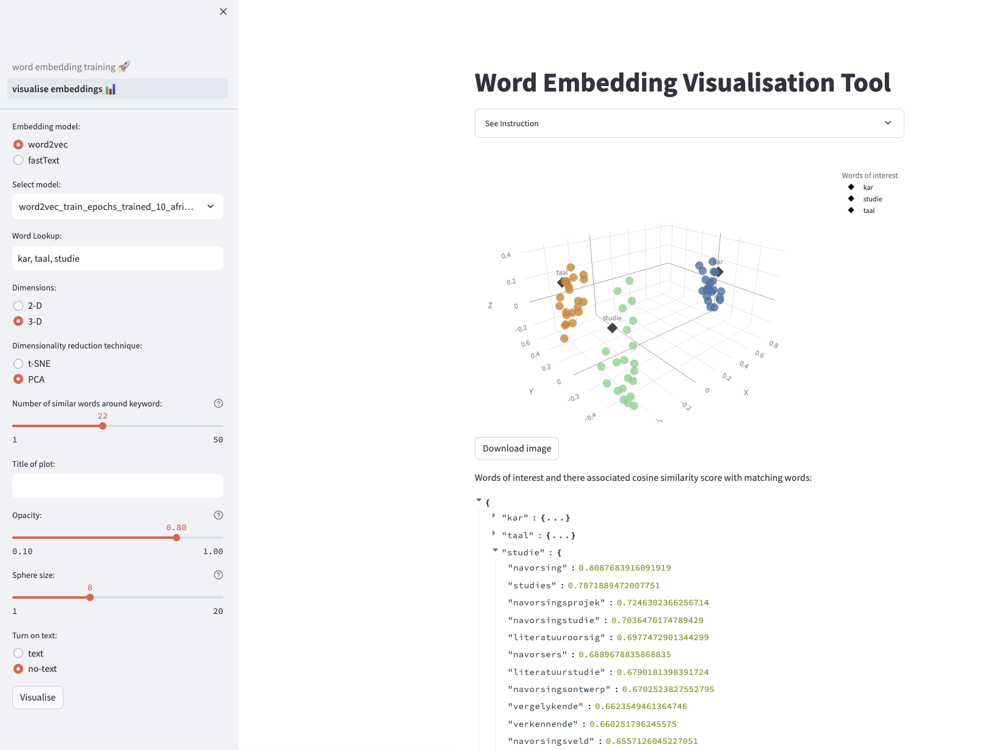

# SADiLaR Word Embedding Toolkit

Please follow the instructions below.

## Installation

For installation to work as expected please ensure you are running `python=3.9` on your local machine before creating the virtual environment.
#### Create a virtual environment:

```bash
python3 -m venv venv
```

#### Activate virtual environment:

```bash
source venv/bin/activate
```

#### To deactivate:

```bash
(venv) deactivate
```


#### Install environment dependencies:

Before running the application, ensure that you have Streamlit installed. If not, you can install it using pip:

```bash
pip install -r requirements.txt
```


## Summary of what the tool does

This tool not only facilitates the training and refinement of word embeddings via the fastText and Word2Vec algorithms, catering to users of both the command-line interface (CLI) and a graphical user interface (GUI) through a Streamlit application, but it also encompasses capabilities for the visualisation of the trained embeddings. Supporting a range of training architectures, such as Skip-Gram and Continuous Bag of Words (CBOW), the platform permits extensive customisation of training parameters, including embedding dimensions. Conceived to be accessible to both novices and seasoned professionals, the tool offers a comprehensive suite of features for initiating the training of new models from the ground up, fine-tuning pre-existing models, efficiently managing data and model outputs, and crucially, visualising the trained embeddings to evaluate and interpret their qualities and attributes. Thus, it presents itself as a multifaceted solution for augmenting natural language processing (NLP) applications with custom-trained and visually interpretable word embeddings.


### Page 1 - Word embedding training tool
<p float="left">
  
</p>

### Page 2 - Embedding visualization tool
<p float="right">
  
</p>

## Further instructions
Please change your directory (`cd`) to either `./app` for the GUI tool or `./word_vector_training` for the CLI tool. Then, follow the instructions in the corresponding README files.
