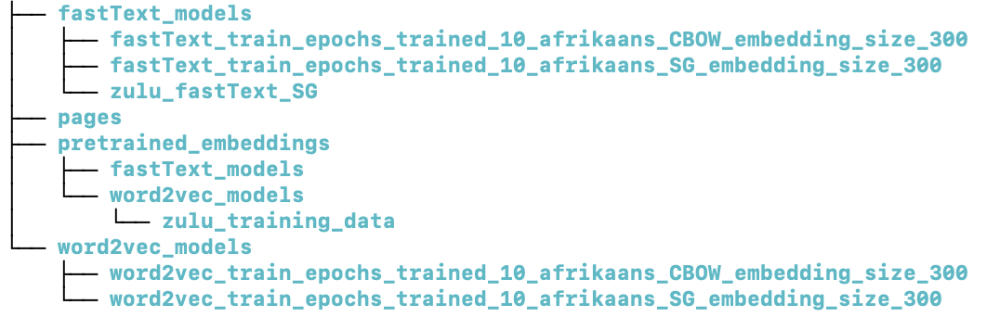

# Word Embedding Training Tool

This Streamlit application offers an intuitive interface for training word embeddings using either the Word2Vec or fastText models. Designed to accommodate both novice and experienced users, it simplifies the process of fine-tuning pre-trained models or training new ones from scratch.

## Key Features

- **Flexible Model Training**: Train word embeddings using Word2Vec or fastText algorithms, with options for starting from scratch or fine-tuning pre-trained models.
- **Customizable Training Parameters**: Easily adjust hyperparameters for your model training, including the algorithm choice (Skip-Gram or CBOW), embedding dimensions, and more.
- **Pre-trained Model Support**: Leverage existing pre-trained models for fine-tuning to specific domains or expanding existing embeddings.
- **User-Friendly Interface**: The Streamlit-based UI makes it simple to upload data, configure training parameters, and initiate training processes without deep technical knowledge.

## Getting Started

## Running the Application
To launch the Word Embedding Training Tool, use the following command:

```bash 
streamlit run word_embedding_training_🚀.py --server.maxUploadSize=2046
```

*Note*: The `--server.maxUploadSize` argument is required to specify the maximum file upload size.
You can adjust this value, for example to `4092`, if you need to upload larger files. This is specifically referring to the CSV file size.

## Using the Application
- **Upload Your Dataset**: The application accepts CSV files containing your textual data. Ensure your dataset is prepared with a `'Sentences'` column.
- **Configure Training Parameters**: Use the sidebar to select your training preferences, such as the model type (Word2Vec or fastText), training algorithm (Skip-Gram or CBOW), and other hyperparameters.
- **Train Your Model**: After configuring the settings, click the "Train word embeddings" button to start the training process. The application will display the progress and notify you upon completion.

## Folder structure created

In the image below, you'll see an example depicting the creation of three new folders. 
To fine-tune pre-trained embeddings, please place the embedding model you intend to train further into the appropriate directory. 
For instance, if you aim to refine a word2vec model, upload it to the corresponding directory as illustrated below. 
The folders `./app/fastText_models` and `./app/word2vec_models` will be generated automatically once an embedding model is trained using any of the provided methods.

<p float="left">
  
</p>


## Customizing and Extending
The application's Python script (`word_embedding_training_🚀.py`) is structured to be easily readable and modifiable. You can adjust the training processes, add new features, or integrate additional models by modifying the script.

## Feedback and Contributions
We welcome feedback and contributions to the Word Embedding Training Tool project. If you have suggestions or want to contribute, please open an issue or pull request on the project's GitHub repository.

**Happy Model Training! 🥳**
